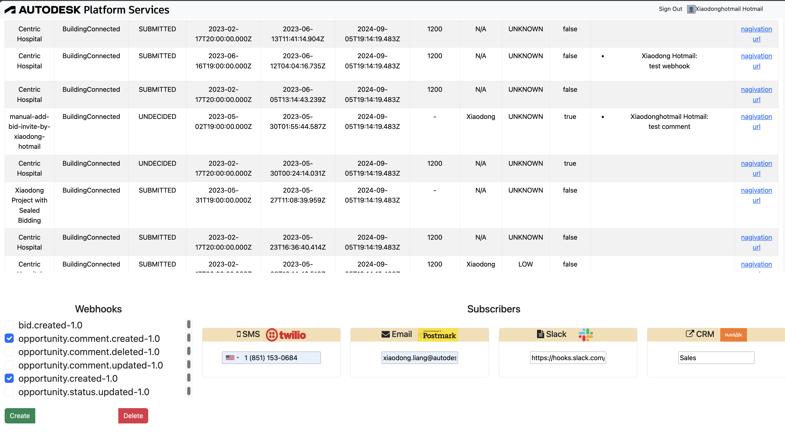
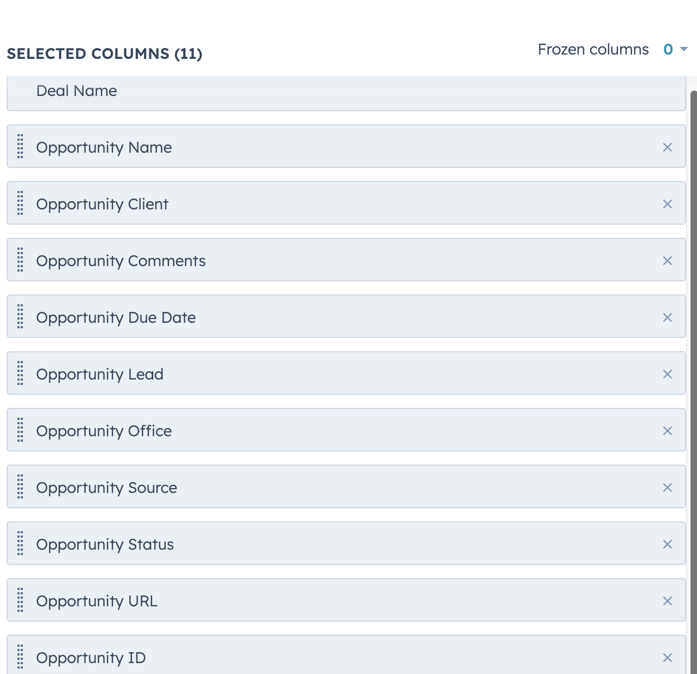
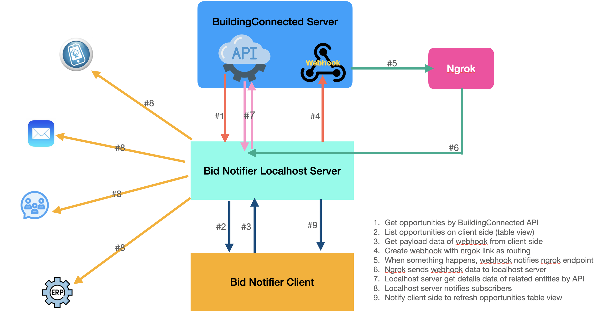
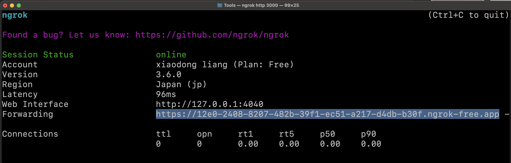

# Demo of BuildingConneted Webhook. Bid Notifier for Phone Message, Email, Slack and HotSpot 

[](https://nodejs.org/)
[](https://www.npmjs.com/)
[]()

[](https://aps.autodesk.com/en/docs/oauth/v2/developers_guide/overview/)

[](https://aps.autodesk.com/en/docs/buildingconnected/v2/developers_guide/overview/) 
[](http://developer.autodesk.com/)

[](http://opensource.org/licenses/MIT)
[](http://developer.autodesk.com/)


# Description

This demos the creating/deleting webhooks with subscribers (SMS, Email, Slack, HubSpot (CRM) and the client side of application). When event happens within BuildingConnected, it will get corresponding entity data and compose notification to the subscribers. 

In currentbid.created : a new bid revision is created.
  - opportunity.comment.created: a new opportunity comment is created.
  - opportunity.comment.deleted: an opportunity comment is deleted.
  - opportunity.comment.updated: an opportunity comment is updated
  - opportunity.created: a new opportunity is created.
  - opportunity.status.updated: an opportunity's status is updated.  

# Thumbnail
 

# Demonstration
[]


## Prerequisites

1. **APS Account**: Learn how to create an APS Account, activate subscription and create an app with [this tutorial](https://tutorials.autodesk.io/). For this new app, use **http://localhost:3000/aps/auth/callback** as Callback URL. Finally take note of the **Client ID**, **Client Secret** and **Callback URL**.
2. **Building Connected Account and Subscription**: Ensure the user has a relevant BuildingConnected subscription. In this sample, BuildingConnected Pro and Bid Board Pro are required.
3.  Create some published bidpackages and opportunities in BuildingConnected manually, for test purpose.
4.  [Create API Keys of Twillo](https://www.twilio.com/docs/iam/api-keys). Make note with **accountSid** and **accountToken**. And also the virtual phone number.
5.  [Create API Keys of Postmark](https://docs.gravitysmtp.com/getting-a-postmark-server-api-token/). Make note with **server API token**  
6.  [Integrate incoming webhook for your Slack group](https://api.slack.com/messaging/webhooks). Make a note with **Slack Webhook URL**
7.  [Create HubSpot app ](https://app.hubspot.com/) and create some columns in one table. Make note with the **api token**. In this sample, we takes advantage of **Deals** table to manage opportunity data. Please create some columns as the screenshot below demos:

 

8.  Download [Ngrok](https://ngrok.com/) 
9.  Basic knowledge with [**Node.js**](https://nodejs.org/en/).
10. Knowledge with **html5**,**JavaScript**, **css**,**jQuery** and **bootstrap**
 
## Technical Workflow

This diagram below shows the workflow of this sample.
 


## Running locally

 - Install latest version of [NodeJS](https://nodejs.org)

 - Clone this project or download it (this `nodejs` branch only). It's recommended to install [GitHub desktop](https://desktop.github.com/). To clone it via command line, use the following (**Terminal** on MacOSX/Linux, **Git Shell** on Windows):

    git clone https://github.com/autodesk-platform-services/aps-bid-notifier

- Run Ngrok, make a note with the routing link for WEBHOOK_CALLBACK in the next step.
    ```
    ./ngrok http 3000
    ```
    

- Install the required packages using `npm install`. Create **.env** file in root folder this sample. Input the credentials of APS. 

        APS_CLIENT_ID=""
        APS_CLIENT_SECRET=""
        APS_CALLBACK_URL="http://localhost:3000/aps/auth/callback"
        WEBHOOK_CALLBACK="https://4a16-2408-8207-482b-39f1-f4de-632e-3d8-9099.ngrok-free.app"
        SERVER_SESSION_SECRET="mysession"
        PORT="3000"

 - Input related credentials of Twillo, Postmark, Slack and Hubspot in [config.js](./config.js) 
 - To debug the sample, set environment variables at [launch.json](/.vscode/launch.json)

        ```
        { 
            "configurations": [
                {
                    "type": "node",
                    "request": "launch",
                    "name": "Launch Program",
                    "skipFiles": [
                        "<node_internals>/**"
                    ],
                    "program": "${workspaceFolder}/start.js",
                    "envFile": "${workspaceFolder}/.env"
                }
            ]
        }
        ```
- To run the sample directly, type the scripts in command line:
    ```
    node --env-file=.env start.js    
    ```

- After the sample runs, open the browser: [http://localhost:3000](http://localhost:3000). Please watch the [Video](https://youtu.be/oJ_bjjhZ-sA) for the detail and usage. 

## Further Reading

- [BuildingConnected](https://aps.autodesk.com/en/docs/buildingconnected/v2/developers_guide/overview/)
- [BuildingConnected Webhook Tutorial](https://aps.autodesk.com/en/docs/webhooks/v1/tutorials/create-a-hook-buildingconnected/)


## License
This sample is licensed under the terms of the [MIT License](http://opensource.org/licenses/MIT). Please see the [LICENSE](LICENSE) file for full details.

## Written by
Xiaodong Liang [@coldwood](https://twitter.com/coldwood), [Developer Advocacy and Support](http://aps.autodesk.com)